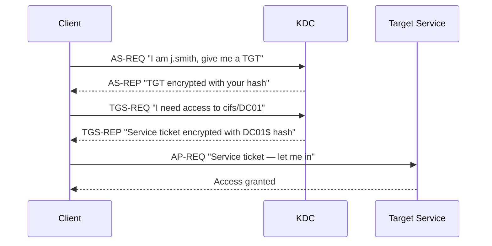

# Kerberos Notes — Attack & Detection Perspective

## Core Concepts

Kerberos is the default authentication protocol in Active Directory. Understanding it is essential for detecting and defending against ticket-based attacks.

### Key Components

| Component | Role | Attack Relevance |
|---|---|---|
| KDC (Key Distribution Centre) | Issues tickets — runs on the DC | Single point of failure |
| TGT (Ticket Granting Ticket) | Proves identity; encrypted with `krbtgt` hash | Golden Ticket if `krbtgt` hash stolen |
| TGS (Ticket Granting Service) | Service access ticket; encrypted with target account's hash | Kerberoasting target |
| SPN (Service Principal Name) | Maps a service to an account | Identifying roastable accounts |
| ccache | Linux file format storing Kerberos tickets | Pass-the-Ticket target |

---

## Normal Authentication Flow



---

## Kerberoasting

Any authenticated domain user can request a TGS for **any** SPN. The TGS is encrypted with the service account's NTLM hash.

| Factor | Detail |
|---|---|
| Privilege required | None — any domain user |
| Target | Accounts with SPNs registered |
| Output | Service ticket encrypted with target's hash |
| Offline crack | `hashcat -m 13100` |

### Detection: Event ID 4769

Look for:
- Encryption type `0x17` (RC4) — modern accounts use AES
- Tickets requested outside business hours
- Bulk TGS requests from a single source

---

## S4U2Self (Service for User to Self)

Allows a service to obtain a service ticket **for itself** on behalf of any user — without that user's password or TGT.

**Legitimate use:** Services receiving non-Kerberos auth (NTLM, forms) need to transition to Kerberos internally.

**In RBCD abuse:**

```
HERMESMED$ requests: "Give me a ticket for Administrator → HERMESMED$"
KDC responds:       "Here is the ticket (Administrator → HERMESMED$)"
```

This is the first step — it proves `HERMESMED$` can act on behalf of `Administrator` for its own services.

---

## S4U2Proxy (Service for User to Proxy)

Uses the S4U2Self ticket to request **a further ticket for a different service** on the user's behalf.

**The RBCD chain:**

```
S4U2Self:  HERMESMED$ gets Administrator → HERMESMED$     [step 1]
S4U2Proxy: HERMESMED$ exchanges it for Administrator → cifs/DC01  [step 2]
```

Because `DC01$` trusts `HERMESMED$` (via `msDS-AllowedToActOnBehalfOfOtherIdentity`), the KDC issues the final ticket.

### Detection: Event ID 4769 + 4768

Watch for:
- Machine account requesting tickets for privileged users (Administrator)
- S4U2Proxy uses specific ticket options (`0x40810010`)

---

## Pass-the-Ticket

The `.ccache` file is a Kerberos credential cache. On Linux, Impacket tools read it via the `KRB5CCNAME` environment variable.

```bash
# Load the ticket
export KRB5CCNAME=./Administrator.ccache

# Confirm ticket is valid
klist

# Authenticate without a password
impacket-smbclient -k -no-pass Administrator@dc01.ctf.local
```

### Key points

- The ticket is time-limited (default 10 hours)
- If exploitation takes too long, re-run `getST`

### Detection: Event ID 4624

Look for Kerberos logons where:
- Source IP does not match the account's normal workstation
- `LogonType=3` (network) with `AuthenticationPackageName=Kerberos`
- Privileged accounts (Administrator) authenticating from unusual hosts

---

## Lab-Specific Ticket Flow

```
j.smith's TGT        → LDAP queries, SMB access
t.jones' TGT         → Password reuse validation
r.williams' TGT      → MachineAccountQuota check, RBCD write
HERMESMED$ TGT       → S4U chain
Administrator ccache → C$ access, flag retrieval
```
